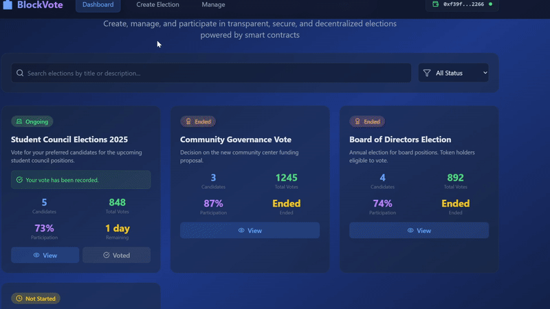

# DAO-Election-System
An upgradeable, modular, and secure DAO Voting/Election DApp built with OpenZeppelin's UUPS Proxy pattern.

---
# Overview
This project implements an upgradeable DAO Election system using Solidity and OpenZeppelin's UUPS proxy pattern. It supports multiple voting strategies, upgradeable contracts, and modular design for flexibility and maintainability.

---

## Security Considerations

* All upgrades are restricted via `onlyOwner`
* Reentrancy protection added to voting functions
* Emergency stop disables voting and hides results

## Dependencies

* OpenZeppelin Contracts Upgradeable
  * `Initializable`
  * `UUPSUpgradeable`
  * `OwnableUpgradeable`
  * `ReentrancyGuardUpgradeable`
  * `ERC1967Proxy`
 
# Demo Frontend (no blockchain interaction!)



## Features

### Election Functionalities

* Multiple voting modes:
  * `WinnerTakesAll`
  * `Leaderboard`
* Voting schemes:
  * Direct vote
  * Commit-reveal (for privacy)
* Live/hidden results
* Candidate registration (by owner or open)
* Flexible voter eligibility:
  * Whitelist
  * Open registration
  * Token-based
  * NFT-based
* Participation metrics and result exports
* Reveal phase support for commit-reveal elections

### Emergency Control

* Pause election early via `emergencyStop()`
* Control visibility of results in emergencies

### Upgradeable Design (UUPS)

* Powered by OpenZeppelin `UUPSUpgradeable`
* Upgrade logic using `ElectionFactory.updateElectionImplementation()`
* Enforced upgrade authorization via `onlyOwner`

### Factory Pattern

* `ElectionFactory` deploys new `Election` proxies
* Tracks elections by creator address
* Handles encoded initialization at creation

## Architecture Overview

ElectionFactory -> ERC1967Proxy -> Election (Logic)

* ElectionFactory owns the logic contract and creates upgradeable proxies
* Each Election contract is upgradeable via UUPS
* Storage and logic are separated to enable safe upgrades

## Smart Contracts

### Election

Upgradeable logic contract using:

* `Initializable`
* `UUPSUpgradeable`
* `OwnableUpgradeable`
* `ReentrancyGuardUpgradeable`

#### Key Functions

* `initialize(...)`: Initializes state (owner, config, eligibility)
* `_authorizeUpgrade(...)`: Restricts upgrade to contract owner
* `registerCandidate(...)`: Candidate self or admin registration
* `registerToVote()`: Based on eligibility mode
* `vote(...)`: Cast direct vote
* `commitVote(...)` and `revealVote(...)`: Commit-reveal flow
* `getResults()`, `getWinner()`, `getLeaderboard()`: Election insights
* `emergencyStop()`: Emergency halt election
* `updateElectionSettings(...)`: Update configs pre-start

### ElectionFactory

Handles proxy deployment and logic upgrades.

#### Key Functions

* `createElection(...)`: Deploys `ERC1967Proxy` pointing to `Election` logic
* `updateElectionImplementation(...)`: Change the logic contract
* `getAllElections()`, `getCreatorElections()`: Query elections
* `getElectionAddress(id)`: Get proxy by ID

## How Upgradeability Works

### Initial Setup

Proxies are deployed with a delegatecall to `initialize()` with encoded params.
This sets state variables directly in the proxy's storage.

### Upgrading

Only the contract owner can upgrade the logic of a proxy using UUPS.

```solidity
function _authorizeUpgrade(address newImplementation) internal override onlyOwner {}
```

### Example

```solidity
ElectionUpgradeable newImpl = new ElectionUpgradeable();
proxy.upgradeTo(address(newImpl));
```

## ElectionConfig Structure

```solidity
struct ElectionConfig {
    string title;
    string description;
    uint256 startTime;
    uint256 endTime;
    uint256 candidateRegistrationDeadline;
    VotingType votingType;
    bool openCandidateRegistration;
    bool liveResultsEnabled;
    bool resultsPublic;
    bool useCommitReveal;
}
```

## VoterEligibilityMode Enum

```solidity
enum VoterEligibilityMode {
    Whitelist,
    OpenRegistration,
    TokenBased,
    NFTBased
}
```

## Events Emitted

| Event                              | Description                |
| ---------------------------------- | -------------------------- |
| `ElectionCreated`                  | Election deployed          |
| `CandidateRegistered`              | Candidate joins election   |
| `VoterRegistered`                  | Voter registers            |
| `VoteCast`                         | Vote recorded (non-commit) |
| `VoteCommitted`, `VoteRevealed`    | Commit-reveal flow         |
| `ElectionStarted`, `ElectionEnded` | Status change              |
| `EmergencyStop`                    | Admin triggered stop       |
| `ResultsEnabledAfterEmergency`     | Admin allows results       |
| `RevealPhaseStarted`               | Reveal phase initiated     |

## Usage Guide

### 1. Deploy the Implementation

```solidity
Election electionImpl = new Election();
```

### 2. Deploy the Factory

```solidity
ElectionFactory factory = new ElectionFactory(address(electionImpl));
```

### 3. Create a New Election

```solidity
factory.createElection(
    config,
    VoterEligibilityMode.OpenRegistration,
    0,
    address(0)
);
```

### 4. Interact With Election Proxy

```solidity
Election proxy = Election(factory.getElectionAddress(electionId));
proxy.registerToVote();
proxy.vote(candidateId);
```

### 5. Upgrade Logic

```solidity
Election newImpl = new ElectionV2();
factory.updateElectionImplementation(address(newImpl));
// Call upgradeTo() from frontend or script
```

## License

MIT License
